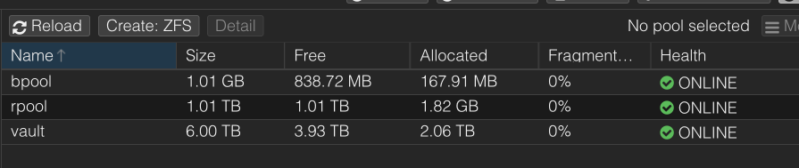

# Proxmox ZFS Migrate

> Script allows to migrate existing LVM Proxmox installation to mirrored ZFS (on root).

## Disclaimer

The software provided on this site is distributed "as is" and without
warranties of any kind, either express or implied. Use of the software
is at your own risk.

## Table of Contents

- [Usage](#usage)
   * [Assumptions](#assumptions)
   * [Description](#description)
   * [Configuration](#configuration)
   * [Variables overview](#variables-overview)
- [Testing migration using VM inside Proxmox VE](#testing-migration-using-vm-inside-proxmox-ve)
   * [First run](#first-run)
   * [Second run](#second-run)
   * [Third run](#third-run)
   * [Fourth run](#fourth-run)
   * [Proxmox VE is fully migrated](#proxmox-ve-is-fully-migrated)
   * [Upgrade Proxmox VE](#proxmox-ve-upgrade)
- [Migrate on production Proxmox VE](#migrate-on-production-proxmox-ve)
- [Links](#links)

## Usage

### Assumptions

Script will work under assumptions below:

1. Proxmox node installed on one disk (LVM).

2. The is another disk the same type and approx same size.

3. There are NO images of VM/LXC on configured Proxmox storage used this disk.

4. There are NO running VM/LXC on this Proxmox node.

5. On Proxmox node might be configured other ZFS pools.

### Description

Migration using this script take approximately 10 to 15 minutes.
Exact time depends on many factors, primarly of hardware and
the amount of data on existing installation to be
transferred and mirrored.

### Configuration

Script using configuration variables which allows to set
up some parameters (e.g. disk devices, size of partitions).

Configurations is is pure `bash` script which be consumed by
migrate script.

Sample configuration file included (`vars.sample`). It
can be copyed and edited to settle the needs.

    $ cp vars.sample vars
    $ nano vars

### Variables overview

#### DISK_OLD

Full path to device running Proxmox VE installation (node).
Preferrable to use `by-id`. Default value:

    /dev/disk/by-id/scsi-0QEMU_QEMU_HARDDISK_drive-scsi1

#### DISK_NEW

Extra disk to set up ZFS pools (at first) and migrate
existing Proxmox VE installation. Default value:

    /dev/disk/by-id/scsi-0QEMU_QEMU_HARDDISK_drive-scsi0

#### SWAP_SIZE

Swap file will be create as ZVOL and added during migration.
Default value:

    1G

#### PARTITION_TABLE

Migrations script split disks into partitions. This
parameter allows to tune partition sizes. Default values:

    [bios]   +1M
    [efi]  +512M
    [boot] +512M
    [root] -600M

With this values disk will be slices as shown in table below.

| Part. No | Size       | Key  | Description  | Proxmox VE mount |
| -------- |----------- | ---- | ------------ | ---------------- |
| -        |    7.0 KiB | -    | free space   | -                |
| 1        | 1024.0 KiB | bios | BIOS boot    | -                |
| 2        |  512.0 MiB | efi  | EFI boot     | `/boot/efi`      |
| 3        |  512.0 MiB | boot | Solaris boot | `/boot`          |
| 4        |  *         | root | Solaris root | `/`              |
| -        |  600.0 MiB | -    | free space   | -                |

In total 4 partitions will be created. Solaris root partition
size will occupy all available disk space (marked by `*`) except
the number written in this variable (unassigned). As example on
disk 10000M and default values for variable the root partition
will occupy

    10000M - 1025M - 600M = 8375M

#### INSTANCE

The name of dataset as [Proxmox VE](https://pve.proxmox.com/wiki/ZFS_on_Linux)
create itself when installing straight to ZFS. Default value:

    pve-1

#### FSTAB_OLD_ROOT

Current value of root filesystem in `/etc/fstab`. Default value:

    /dev/pve/root

#### FSTAB_OLD_SWAP

Current value of swap filesystem in `/etc/fstab`. Default value:

    /dev/pve/swap

## Testing migration using VM inside Proxmox VE

The Proxmox VE testing VM uses configuration [pve-dev.conf](docs/pve-dev.conf).

Summary page (Datacenter - pve-dev - Summary):

Disks page (Datacenter - pve-dev - Disks):

ZFS page (Datacenter - pve-dev - Disks - ZFS):

Test set up contains preconfigured ZFS pool `vault`:

### First run

First run creates many things:

* Partitionins new disk;

* Adds ZFS boot and root pools;

* Adds ZFS datasets (`rpool/tmp`, `rpool/data`, `rpool/swap`)

* Fixes fs table, set mountpoints, boot fs;

* Updates EFI boot partitions;

Stage output available in file [migrate-stage-base.log](docs/migrate-stage-base.log).

In order to continue migration reboot required. After that need to re-run script and follow next stage.

### Second run

Second run does a few things:

* Changes LVM attributes;

* Adds newly created dataset (`rpool/data`) as Proxmox VE storage (`flash`);

Stage output available in file [migrate-stage-storage.log](docs/migrate-stage-storage.log).

In order to continue migration reboot required. After that need to re-run script and follow next stage.

### Third run

Third run does a few things:

* Replicates structure an old disk to new disk;

* Refresh and switch EFI boot to new disk;

Stage output available in file [migrate-stage-layout-old.log](docs/migrate-stage-layout-old.log).

In order to continue migration reboot required. After that need to re-run script and follow next stage.

### Fourth run

Fourth run does a few things:

* Refresh EFI boot on both disks;

* Adds partitions of old disk to the corresponding ZFS pool;

This stage required to wait the resilvering process and then reboot.

### Proxmox VE is fully migrated

Summary page (Datacenter - pve-dev - Summary):

Disks page (Datacenter - pve-dev - Disks):

ZFS page (Datacenter - pve-dev - Disks - ZFS):

ZFS pool `rpool`:

ZFS pool `bpool`:

### Upgrade Proxmox VE

There is no difficulties to upgrade Proxmox VE in this (new) disk configuration.

Just check updates

    apt update

Sample output in [apt-update.log](docs/apt-update.log).

And the do upgrade

    apt dist-upgrade

Sample output in [apt-dist-upgrade.log](docs/apt-dist-upgrade.log).

After reboot the newly added kernel will be loaded. Upgraded Proxmox VE shown below.

Summary page (Datacenter - pve-dev - Summary):

## Migrate on production Proxmox VE

I've been migrated my Proxmox VE installation using this script.

Here is disk specs:

* ADATA XPG GAMMIX S11 Pro M.2 NVME 1 Tb (2x);
* WD Red Pro WD6003FFBX-68MU3N0 SATA 6 Tb (2x);

Proxmox VE was installed on first NVME.

After script done:

And the Proxmox VE dist-upgrage brings new kernel. So the kernel upgraded from `6.8.12-5-pve` to `6.8.12-8-pve`.

## Links

[Proxmox: ZFS on Linux](https://pve.proxmox.com/wiki/ZFS_on_Linux)

[OpenZFS: Debian Bookworm Root on ZFS](https://openzfs.github.io/openzfs-docs/Getting%20Started/Debian/Debian%20Bookworm%20Root%20on%20ZFS.html)
